# CICD‑todo‑nodejs‑app

A production‑ready **Todo list REST API** written with **Node.js + Express** and delivered through an automated **CI/CD pipeline** all the way to Kubernetes.

> **Heads‑up – two repositories work together**
>
> | Repo | What it holds | Git URL |
> | ---- | ------------- | ------- |
> | **Application / CI pipeline** | Source code, unit tests, Dockerfile, GitHub Actions workflows | **(this repo)** |
> | **Infrastructure / GitOps** | Kubernetes base overlays, Helm charts, Ansible roles, Terraform modules | <https://github.com/OmarIRG/infra-repo> |

---

## 1. Project goals

1. **Build** a clean Node.js micro‑service that exposes CRUD endpoints for *todo* items.  
2. **Test** every commit (unit + lint) automatically.  
3. **Package** the service as an immutable Docker image.  
4. **Publish** the image to Docker Hub under an internship namespace.  
5. **Deploy** the image to a Kubernetes cluster via GitHub Actions (zero‑downtime rolling updates).  
6. **Separate concerns** – keep all cluster‑state and IaC artifacts in a dedicated *infra‑repo*.  
7. **Document** everything so that any new team member can get from *git clone* to *production* in minutes.

---

## 2. High‑level architecture

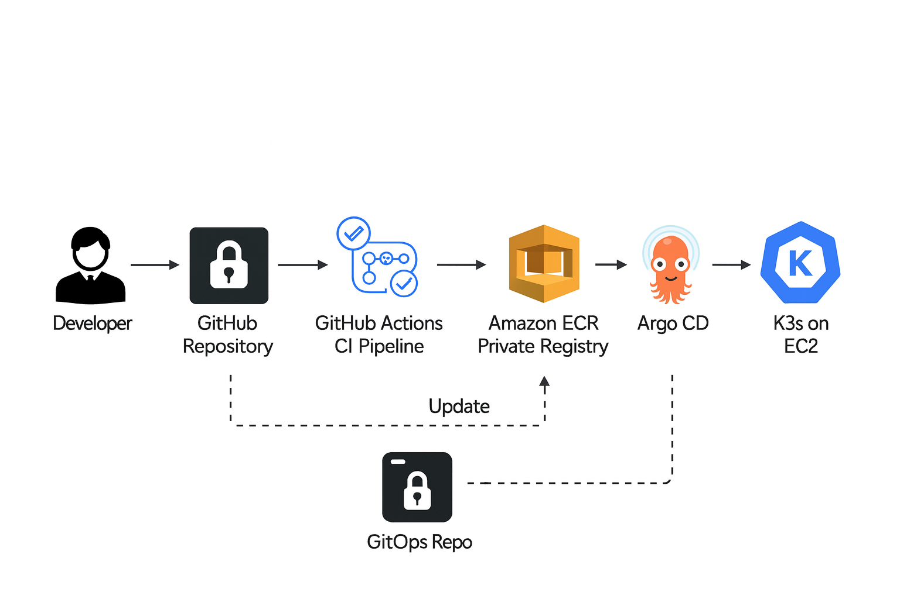

---

## 3. Local development

```bash
# 1. Clone
git clone https://github.com/<your‑org>/CICD-todo-nodejs-app.git
cd CICD-todo-nodejs-app

# 2. Install & test
npm ci
npm test

# 3. Run locally
cp .env.example .env        # adjust variables if needed
npm run dev                 # nodemon + hot reload
```

*Default port:* **`localhost:3000`**  
Swagger UI is automatically available at **`/api-docs`** when `NODE_ENV=development`.

---

## 4. CI pipeline (in this repo)

| Stage | GitHub Actions Job | Key steps |
| ----- | ------------------ | --------- |
| **Test**   | `ci-test`         | `npm ci`, `npm run lint`, `npm test --coverage` |
| **Build**  | `ci-build`        | Build multi‑arch image with BuildKit |
| **Publish**| `ci-push`         | Log‑in to Docker Hub using `DOCKER_USERNAME / DOCKER_TOKEN` secrets; push image tagged with `sha` + `latest` |
| **Security** | `ci-scan` (optional) | Trivy vulnerability scan fails build on *HIGH* / *CRITICAL* findings |

*Trigger:* every push or pull‑request to `main` or any feature branch.

---

## 5. CD pipeline (in this repo)

*Workflow file:* `.github/workflows/cd-deploy.yml`

| Step | Description |
| ---- | ----------- |
| Checkout `infra-repo` at the same commit SHA used in `main` |
| Substitute the *image tag* inside `k8s/base/deployment.yaml` using `yq` |
| Commit the change back to **`infra-repo`** ➜ this is the GitOps signal |
| Argo CD (running in‑cluster, configured in `infra-repo`) detects the commit and performs `kubectl apply` |
| Deployment strategy is `RollingUpdate` with `readinessProbe` to guarantee zero downtime |

---

## 6. Infrastructure repository (`infra-repo`)

```
infra-repo/
├── ansible/            # bootstrap bare Ubuntu node → k8s single‑node lab
├── k8s/
│   ├── base/           # plain‑YAML manifests tracked by Argo CD
│   └── overlays/       # environment specific kustomize patches
├── helm/               # (optional) Helm charts for future micro‑services
└── terraform/
    └── aws-eks/        # IaC module that stood‑up the EKS playground cluster
```

All cluster credentials are stored as **GitHub Secrets** in the CICD app repo:

* `KUBE_CONFIG_DATA` – base64‑encoded kube‑config with `deployment-bot` SA  
* `ARGOCD_AUTH_TOKEN` – used only by cluster‑seeder job (one‑off)  

> The *only* thing that ever directly touches the cluster is Argo CD.  
> GitHub Actions writes **declarative state** to `infra-repo`; Argo CD reconciles.

---

## 7. Branching & environments

| Branch | Environment | Notes |
| ------ | ----------- | ----- |
| `main` (protected) | **production** | Auto‑deploy, manual PR review required |
| `stage/*`          | *staging*      | Deploys to `todo-ns-stg` namespace |
| `feat/*`, `bug/*`  | *ephemeral*    | Preview namespace created by CD workflow, destroyed on merge/close |

---

## 8. Monitoring & logging

| Stack | Where configured |
| ----- | ---------------- |
| **Prometheus + Grafana** | `infra-repo/k8s/monitoring/` |
| **Loki + Grafana Loki** | Same directory – collects pod logs |
| **Alertmanager**        | PagerDuty webhook (internship sandbox) |

---

## 9. Running the whole stack locally (optional)

```bash
# Requires Docker Desktop or kind
make kind-create          # 1‑node Kubernetes cluster
make deploy-dev           # deploy manifests from ./k8s/base
make port-forward         # exposes app on localhost:8080
```

---

## 10. Screenshots & Proof‑of‑Work

All screenshots captured during the internship are stored in the **`images/`** folder.  
Below is an embedded gallery so that they render inline on GitHub:


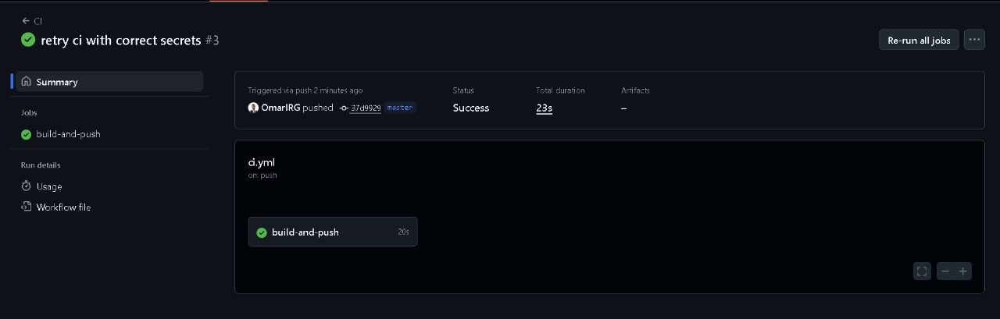
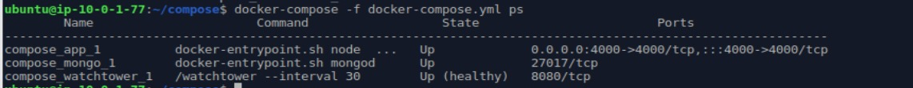


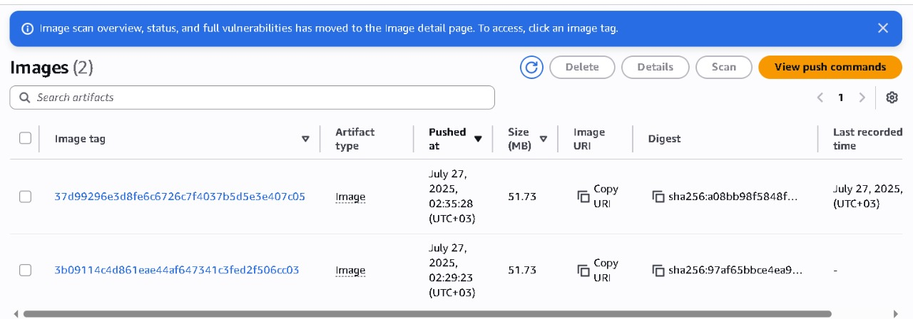

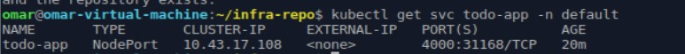
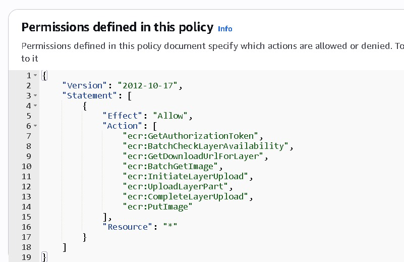

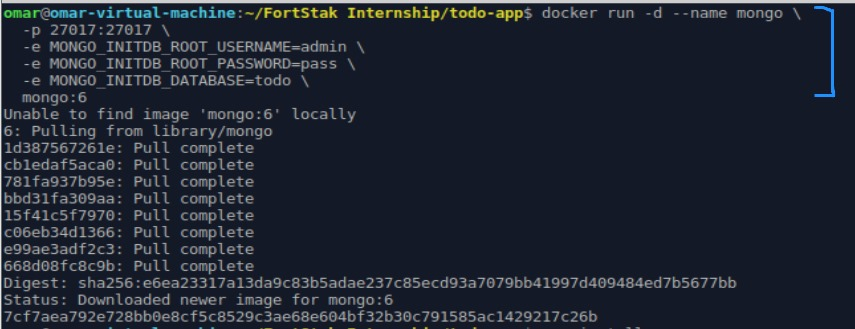
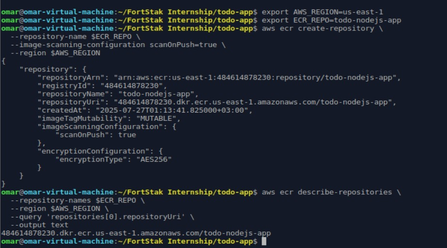


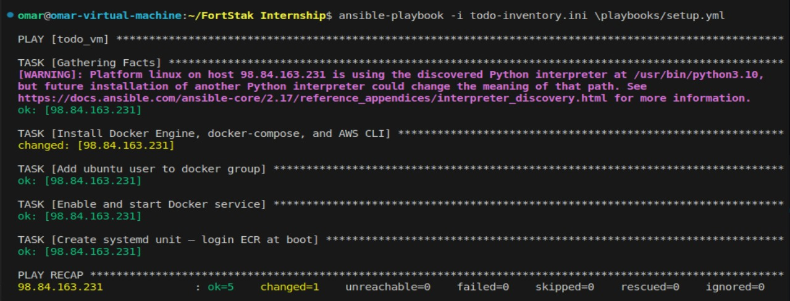
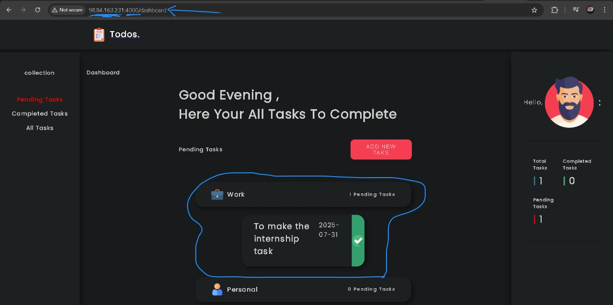
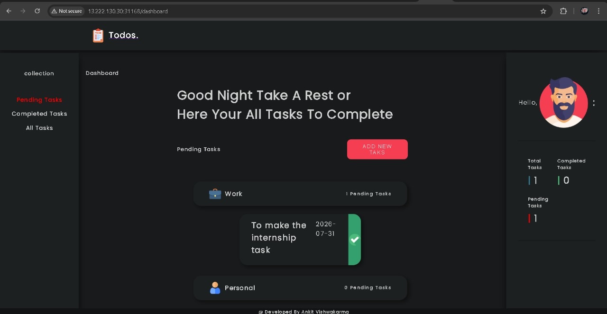


> **Tip:** If some images do not render on GitHub, double‑check that their file names (and any spaces) match exactly and live in a top‑level `images/` directory.

---

## 11. Contribution guidelines

* **Conventional Commits** style (`feat:`, `fix:`, …)  
* Every PR **must** pass CI checks and have at least one review.  
* Commit any infrastructure change to **`infra-repo`** not here.  
* Update this README whenever a new capability is added!

---

## 12. License

MIT – see `LICENSE` file.

---

## 13. Authors

*Internship DevOps team – Summer 2025*  
Mentor: **Omar I.** (<https://github.com/OmarIRG>)  
Contributors: *add your name via PR!*
